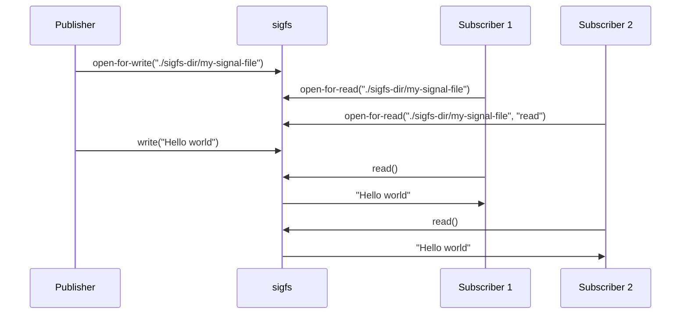

# SIGFS - SIGNAL FILE SYSTEM 
**Copyright (C) 2022 - Magnus Feuer**

This repo contains a signal pub/sub message bus implemented as a fuse
virtual file system.  The target are embedded (automotive) systems
that need a fast, secure, robust, and lightwait signal distribution
mechanism that replaces more traditional approaches of using using
DBUS, MQTT or other similar solutions.


<!-- markdown-toc start - Don't edit this section. Run M-x markdown-toc-refresh-toc -->
**Table of Contents**

- [SIGFS - SIGNAL FILE SYSTEM](#sigfs---signal-file-system)
- [REQUIREMENTS](#requirements)
- [HOW IT WORKS](#how-it-works)
- [BUILDING SIGFS](#building-sigfs)
- [STARTING SIGFS](#starting-sigfs)
- [LOGGING](#logging)
- [TRYING OUT SIGFS](#trying-out-sigfs)
- [SAMPLE PUBLISHER CODE](#sample-publisher-code)
- [SAMPLE SUBSCRIBER CODE](#sample-subscriber-code)
- [PROGRAMMER'S GUIDE](#programmers-guide)
    - [Opening a signal file for writing/publishing](#opening-a-signal-file-for-writingpublishing)
    - [Writing/publishing to a signal file](#writingpublishing-to-a-signal-file)
    - [Opening a signal file for reading/subscribing](#opening-a-signal-file-for-readingsubscribing)
    - [Reading/subscribing from a signal file](#readingsubscribing-from-a-signal-file)
    - [Blocking calls and non-blocking I/O](#blocking-calls-and-non-blocking-io)
    - [Interrupted calls](#interrupted-calls)
- [Performance](#performance)
- [FAQ](#faq)

<!-- markdown-toc end -->

# REQUIREMENTS
SIGFS has the following design objectives, derived from automotive
requirements:

1. **Fast**  
   Sigfs transmits 200,000-1,000,000 signals / second between a single
   publisher and subscriber, depending on how many signals are grouped
   into each write(2) call by the publisher.

3. **Easy to integrate**  
   Sigfs is purely interfaced by file operations such as `open()`,
   `read()`, `write()`, and `[e]poll()`, enabling any programming
   language with file I/O support to publish and subscribe to signals
   without any libraries or other dependenceies.
   
2. **Scalable**  
   Grouping ten signals into each publish / write operations, increasing the number
   of subscribers from one to ten halves the signal throughput from ~1,000,000 to ~500,000.
   **MORE**

3. **Secure** *Not yet implemented*  
   The sigfs configuration file whitelists uids and gids that can
   publish and subscribe to each signal file in the tree, providing
   granular mandatory access control.
   
4. **Fast startup times** 
   Sigfs consists of a single process written in C++ with no
   dependencies on other processes, enabling fast startup.  The
   configuration file can be pre-compiled and mapped directly into
   memory, making it instantly available without any processing. *Not
   yet implemented* The time from `main()` being called to the event
   loop being invoked is **XXXX** microseconds.

4. **Controlled dependencies** 
    Upstread dependencies are minimal with `libc`, `libstdc++`,
   `libpthread`, `libdl`, and `libfuse`. Of these only `libfuse`, a
   well-established component in the Linux eco system, is not
   pre-installed in linux distros and Yocto-builds.
   

# HOW IT WORKS




The data written and read from a file are grouped into *signals*,
which are treated as separate units that cannot be divided.

A writer of signals are called *publishers*, and readers are called
*subscribers*.

Sigfs works like much like traditional Linux fifo (first-in
first-out), described by the `fifo(7)` man page, with the following
main design features.

1. **Guaranteed delivery**  
   Unlike UDP-based pub/sub system, a subscriber is guaranteed to
   receive a published signal as long as the it is not overwritten
   in the sigfs circular buffer due to the subscriber being too slow
   to invoke read. 

1. **Multiple readers**  
   When multiple processes are reading/subscribing from a single sigfs
   file, each one will get a copy of any signals written to that file.

1. **Multiple writers**  
   When multiple processes are writing/publishing to a single sigfs
   file, a subscriber will get a copy of the signals written by each
   writer.

2. **Atomic read/writes**
   Each signal published to a file will be treated as an atomic
   unit. Readers will ether get all the entire signal or no signal at all.  
   The buffer provided by a reader will be filled with as many signals
   as possible, leaving any signals that did not fit into the buffer
   to be read later.

3. **Writes never blocks**  
   A write operation of a valid signal will always succeed. If the
   internal sigfs circular buffer is full then the oldest signal will
   be overwritten (and lost).

4. **Data loss tracking**  
   If a subscriber waits too long to invoke read, and the internal
   sigfs circular buffer overwrites the next signal to be read, the
   subscriber will receive information about how many signals were
   lost. The internal buffer size can be specified in the
   configuration file.

# BUILDING SIGFS

    $ make
    $ make debug # See logging chapter below
    
The package `libfuse3-dev` needs to be installed to provide the FUSE
library and header files.


# STARTING SIGFS

    $ mkdir sigfs-dir
    $ /sigfs -c sigfs.cfg -f ./sigfs-dir 

The command line arguments to sigfs are forwarded directly to the
underlying FUSE library (libfuse).  The only added parameter is `-c
<config-dile>`, specifying the sigfs JSON configuration file to use.

Running `sigfs` will mount a file system on top of the specified
directory (`./sigfs-dir`) and create a number of signal files in that
file system. The signal files to create are read from the
configuration file.

Please use `sigfs --help` for a list of available options.

**NOTE**: `sigfs` currently only creates a single file,
`"./sigfs-dir/x"`. Future versions will support full-blown directory
trees with multiple signal files.


# LOGGING
Sigfs and the sample & test C++ programs all have extensive logging that are activated in the debug build:

    $ make debug
    
Logging level is set by the environment variable `SIGFS_LOG_LEVEL` that can be between 0 - no logging and 6 - debugging.

Logging has the following format: 


    D 695365 [000] sigfs.cc:389 do_write(2): Processed 8 bytes

* **`D`** - Log level  
Can `D`ebug (level 6), `C`omment (level 5), `I`nfo (level 4),
`W`arning (level 3), `E`rror (level 2), `F`atal (level 1).

* **`695365`** - Time stamp  
Number of microseconds since logging was started

* **`[000]`** - Thread index  
Color coded (when printing to terminal) index for each thread to ease
reading logs from multiple threads.

* **`sigfs.cc:389`** - Log location  
Source file and line number of the logging call.

* **`do_write(2): Processed 8 bytes`** - Log text  
Log entry text.


# TRYING OUT SIGFS
In a terminal window, start the sample subscriber:

    $ ./example/sigfs-subscribe -f ./sigfs-dir/x

In another terminal window, run the sample publisher:

    $ ./example/sigfs-publish -f ./sigfs-dir/x -d "Hello world"


# SAMPLE PUBLISHER CODE
The following python code publishes a signal to a sigfs file:

```python
data = "Hello world"
data_len = len(data)
with open("sigfs-dir/my-signal-file", "wb") as f:
    bin_data = struct.pack(f"=I{data_len}s", data_len, bytes(data, "ascii"))
    f.write(bin_data)
```

Each write to a sigfs signal file has the following format:

| Start byte | Stop byte        | Name         | Type   | Description                  |
|------------|------------------|--------------|--------|------------------------------|
| 0          | 3                | payload_size | uint32 | Payload size                 |
| 4          | 4+$payload_size  | payload      | data   | Payload                      |

* **`payload_size`**  
    Specifies the number of bytes of the subsequent payload.

* **`payload`**  
    Contains the signal payload/

# SAMPLE SUBSCRIBER CODE
The following python code reads a signal from a sigfs file:

```python
with ("sigfs-dir/my-signal-file", "rb") as f:
    data = f.read(4+8+4)

    (lost_signals, signal_id, payload_size) = struct.unpack("=IQI", data)
    payload = f.read(payload_size)
```

Each read from a sigfs signal file will return data with the following format.

| Start byte | Stop byte        | Name         | Type   | Description                  |
|------------|------------------|--------------|--------|------------------------------|
| 0          | 3                | signals_lost | uint32 | Signals lost since last read |
| 4          | 11               | signal_id    | uint64 | Unique signal ID             |
| 12         | 15               | payload_size | uint32 | Payload size                 |
| 16         | 16+$payload_size | payload      | data   | Payload                      |

* **`signals_lost`**  
    Specifies the number of signals lost since the last time the 
    process invoked read.  
    Signals are lost if they are published faster than the subscriber
    can read them, eventually overwriting the internal sigfs circular
    buffer.

* **`signal_id`**  
    Specifies a unique ID for the returned signal.  
    The signal ID will never be repeated for the same signal file for
    as long as the `sigfs` process is running.  The same signal ID may
    be used in two different signal files.
    
* **`payload_size`**  
    Specifies the number of bytes of the subsequent payload.

* **`payload`**  
    Contains the signal payload, as written by the publisher.


# PROGRAMMER'S GUIDE
The following chapters describe the file system call sequence used to
publish and subscribe to signals in a sigfs file. System calls are
used since it is the most low-level interface that any programming
language eventually uses to do file I/O.


## Opening a signal file for writing/publishing
The sigfs signal file is opened as with any regular file, using the
write-only flag to disable reading. Do not use the append flag.


    fd = open("./sigfs-dir/my-signal-file", O_RDONLY);

The returned file descriptor can be written to in order to 

## Writing/publishing to a signal file
TBD

## Opening a signal file for reading/subscribing

## Reading/subscribing from a signal file
TBD


## Blocking calls and non-blocking I/O
TBD

## Interrupted calls
TBD

# Performance
TBD

# FAQ
1. Can I open a file for reading and writing?
2. What happens if no signals are available when I call read?
3. More

