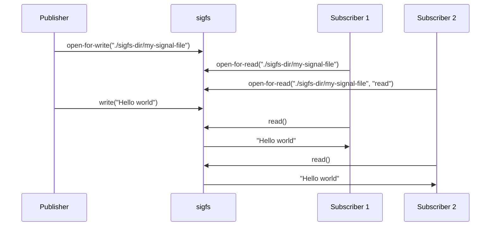

# SIGFS - SIGNAL FILE SYSTEM 
**Copyright (C) 2022 - Magnus Feuer**

This repo contains a signal pub/sub message bus implemented as a fuse
virtual file system.  The target are embedded (automotive) systems
that need a fast, secure, robust, and lightwait signal distribution
mechanism that replaces more traditional approaches of using using
DBUS, MQTT or other similar solutions.

SIGFS has the following design objectives, derived from automotive
requirements:

1. **Fast**  
   Sigfs transmits 200,000-1,000,000 signals / second between a single
   publisher and subscriber, depending on how many signals are grouped
   into each write(2) call by the publisher.

3. **Easy to integrate**  
   Sigfs is purely interfaced by file operations such as `open()`,
   `read()`, `write()`, and `[e]poll()`, enabling any programming
   language with file I/O support to publish and subscribe to signals
   without any libraries or other dependenceies.
   
2. **Scalable**  
   Grouping ten signals into each publish / write operations, increasing the number
   of subscribers from one to ten halves the signal throughput from ~1,000,000 to ~500,000.
   **MORE**

3. **Secure** *Not yet implemented*  
   The sigfs configuration file whitelists uids and gids that can
   publish and subscribe to each signal file in the tree, providing
   granular mandatory access control.
   
4. **Fast startup times** 
   Sigfs consists of a single process written in C++ with no
   dependencies on other processes, enabling fast startup.  The
   configuration file can be pre-compiled and mapped directly into
   memory, making it instantly available without any processing. *Not
   yet implemented* The time from `main()` being called to the event
   loop being invoked is **XXXX** microseconds.

4. **Controlled dependencies** 
    Upstread dependencies are minimal with `libc`, `libstdc++`,
   `libpthread`, `libdl`, and `libfuse`. Of these only `libfuse`, a
   well-established component in the Linux eco system, is not
   pre-installed in linux distros and Yocto-builds.
   

# How it works

The data written and read from a file are grouped into *signals*,
which are treated as separate units that cannot be divided.

A writer of signals are called *publishers*, and readers are called
*subscribers*.

Sigfs works like much like traditional Linux fifo (first-in
first-out), described by the `fifo(7)` man page, with the following
main design features.

1. **Guaranteed delivery**  
   Unlike UDP-based pub/sub system, a subscriber is guaranteed to
   receive a published signal as long as the it is not overwritten
   in the sigfs circular buffer due to the subscriber being too slow
   to invoke read. 

1. **Multiple readers**  
   When multiple processes are reading/subscribing from a single sigfs
   file, each one will get a copy of any signals written to that file.

1. **Multiple writers**  
   When multiple processes are writing/publishing to a single sigfs
   file, a subscriber will get a copy of the signals written by each
   writer.

2. **Atomic read/writes**
   Each signal published to a file will be treated as an atomic
   unit. Readers will ether get all the entire signal or no signal at all.  
   The buffer provided by a reader will be filled with as many signals
   as possible, leaving any signals that did not fit into the buffer
   to be read later.

3. **Writes never blocks**  
   A write operation of a valid signal will always succeed. If the
   internal sigfs circular buffer is full then the oldest signal will
   be overwritten (and lost).

4. **Data loss tracking**  
   If a subscriber waits too long to invoke read, and the internal
   sigfs circular buffer overwrites the next signal to be read, the
   subscriber will receive information about how many signals were
   lost. The internal buffer size can be specified in the
   configuration file.

# Starting sigfs

    $ mkdir sigfs-dir
    $ /sigfs -c sigfs.cfg -f ./sigfs-dir 

The command line arguments to sigfs are forwarded directly to the
underlying FUSE library (libfuse).  The only added parameter is `-c
<config-dile>`, specifying the sigfs JSON configuration file to use.

Running `sigfs` will mount a file system on top of the specified
directory (`./sigfs-dir`) and create a number of signal files in that
file system. The signal files to create are read from the
configuration file.

Please use `sigfs --help` for a list of available options.

# Programmer's guide

The following chapters describe the file system call sequence used to
publish and subscribe to signals in a sigfs file. System calls are
used since it is the most low-level interface that any programming
language eventually uses to do file I/O.

## Publisher's guide
A process wishing to publish signals goes through the steps described below.

### Opening file for writing
The sigfs signal file is opened as with any regular file, using the
write-only flag to disable reading. Do not use the append flag.

    fd = open("./sigfs-dir/", O_RDONLY);

The returned file descriptor can be written to in order to 

# Sample publisher code

# Sample subscriber code
   
# Performance

# FAQ
1. Can I open a file for reading and writing?
2. 

