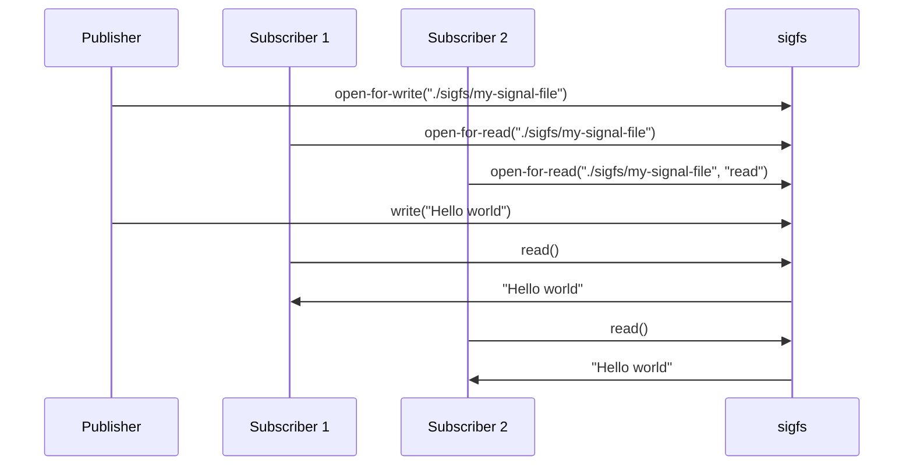

# SIGFS - SIGNAL FILE SYSTEM 
**Copyright (C) 2022-2023 - Magnus Feuer**

This repo contains a signal pub/sub message bus implemented as a fuse
virtual file system.  The target are embedded (automotive) systems
that need a fast, secure, robust, and lightweight signal distribution
mechanism that replaces more traditional approaches of using using
DBUS, MQTT or other similar solutions.


<!-- markdown-toc start - Don't edit this section. Run M-x markdown-toc-refresh-toc -->
**Table of Contents**

- [SIGFS - SIGNAL FILE SYSTEM](#sigfs---signal-file-system)
- [REQUIREMENTS](#requirements)
- [HOW IT WORKS](#how-it-works)
- [BUILDING SIGFS](#building-sigfs)
- [STARTING SIGFS](#starting-sigfs)
- [SIGFS CONFIG FILE FORMAT](#sigfs-config-file-format)
    - [JSON payload example](#json-payload-example)
    - [JSON `root` object](#json-root-object)
    - [JSON directory object](#json-directory-object)
    - [JSON file object](#json-file-object)
    - [JSON `uid_access` object](#json-uid_access-object)
- [LOGGING](#logging)
- [TRYING OUT SIGFS](#trying-out-sigfs)
- [SAMPLE PUBLISHER CODE](#sample-publisher-code)
- [SAMPLE SUBSCRIBER CODE](#sample-subscriber-code)
- [PROGRAMMER'S GUIDE](#programmers-guide)
    - [Opening a signal file for writing/publishing](#opening-a-signal-file-for-writingpublishing)
    - [Writing/publishing to a signal file](#writingpublishing-to-a-signal-file)
    - [Opening a signal file for reading/subscribing](#opening-a-signal-file-for-readingsubscribing)
    - [Reading/subscribing from a signal file](#readingsubscribing-from-a-signal-file)
    - [Blocking calls and non-blocking I/O](#blocking-calls-and-non-blocking-io)
    - [Interrupted calls](#interrupted-calls)
- [Performance](#performance)
- [FAQ](#faq)

<!-- markdown-toc end -->

# REQUIREMENTS
SIGFS has the following design objectives, derived from automotive
requirements:

1. **Fast**  
   Sigfs transmits 200,000-1,000,000 signals / second between a single
   publisher and subscriber, depending on how many signals are grouped
   into each write(2) call by the publisher.

3. **Easy to integrate**  
   Sigfs is purely interfaced by file operations such as `open()`,
   `read()`, `write()`, and `[e]poll()`, enabling any programming
   that can read and write to a file to publish and subscribe to signals
   without any libraries or other dependenceies.
   
2. **Scalable**  
   Grouping ten signals into each publish / write operations, increasing the number
   of subscribers from one to ten halves the signal throughput from ~1,000,000 to ~500,000.
   **MORE DATA TO BE PROVIDED**

3. **Secure** 
   The sigfs configuration file whitelists uids and gids that can
   publish and subscribe to each signal file in the tree, providing
   granular mandatory access control.
   
4. **Fast startup times** 
   Sigfs consists of a single process written in C++ with no
   dependencies on other systems or processes, enabling fast startup.
   The configuration file can be pre-compiled and mapped directly into
   memory, making it instantly available without any processing. *Not
   yet implemented* The time from `main()` being called to the event
   loop being invoked is **XXXX** microseconds.

4. **Controlled dependencies** 
    Upstread dependencies are minimal with `libc`, `libstdc++`,
   `libpthread`, `libdl`, and `libfuse`. Of these only `libfuse`, a
   well-established component in the Linux eco system, is not
   pre-installed in linux distros and Yocto-builds.
   

# HOW IT WORKS




The data written and read from a file are grouped into *signals*,
which are treated as separate units that cannot be divided.

A writer of signals are called *publishers*, and readers are called
*subscribers*.

Sigfs works like much like traditional Linux fifo (first-in
first-out), described by the `fifo(7)` man page, with the following
main design features.

1. **Guaranteed delivery**  
   Unlike UDP-based pub/sub system, a subscriber is guaranteed to
   receive a published signal as long as the it is not overwritten
   in the sigfs circular buffer due to the subscriber being too slow
   to invoke read. 

1. **Multiple readers**  
   When multiple processes are reading/subscribing from a single sigfs
   file, each one will get a copy of any signals written to that file.

1. **Multiple writers**  
   When multiple processes are writing/publishing to a single sigfs
   file, each subscriber will get a copy of the signals written by each
   writer.

2. **Atomic read/writes**
   Each signal published to a file will be treated as an atomic
   unit. Readers will ether get all the entire signal or no signal at all.  
   The buffer provided by a reader will be filled with as many signals
   as possible, leaving any signals that did not fit into the buffer
   to be read later.

3. **Writes never blocks**  
   A write operation of a valid signal will always succeed. If the
   internal sigfs circular buffer is full then the oldest signal will
   be overwritten (and lost).

4. **Data loss is tracked**  
   If a subscriber waits too long to invoke read, and the internal
   sigfs circular buffer overwrites the next signal to be read by the
   subscriber, the subscriber will receive information about how many
   signals were lost. The internal buffer size can be specified in the
   configuration file.


Please note that the sigfs file system is statically defined by the
JSON configuration file.

No directories or files can be added, renamed, deleted, or have their
ownership, timestampts, or permisions changed. Any such operations
will return `EPERM`.


# BUILDING SIGFS

On Ubuntu 24.04:

    $ sudo apt install libfuse3-dev
    $ sudo apt install nlohmann-json3-dev 
    $ make

The package `libfuse3-dev` needs to be installed to provide the FUSE
library and header files.

# STARTING SIGFS

    $ mkdir sigfs-dir
    $ fusermount -f ./sigfs-dir   # Optional unmount in case a previous sigfs process crashed
    $ ./sigfs -c fs.json ./sigfs-dir

This command will create a signal filesystem under `./sigfs-dir` with the subdirectories and files specified by
`fs.json`.

All command line arguments, except `-c <config-file> |--config=<config-file>` 
are forwarded directly to the underlying FUSE library (libfuse).

The following command line arguments are supported, with the FUSE arguments being valid as of libfuse 3.9.4.:

| <div style="width:290px">Argument</div>    | Passed to FUSE | Default | Description                                                                    |
|--------------------------------------------|----------------|---------|--------------------------------------------------------------------------------|
| `-c <json-file>`<br>`--config=<json-file>` | No             | N/A     | Specify sigfs JSON configuration file to use.                                  |
| `-h`<br>`--help`                           | Yes            | N/A     | Display libfuse command line options.                                          |
| `-V`<br>`--version`                        | Yes            | N/A     | Display libfuse version.                                                       |
| `-d`<br>`-o debug`                         | Yes            | N/A     | Enable debugging output (implies -f).                                          |
| `-f`                                       | Yes            | N/A     | Operate in foreground.                                                         |
| `-s`                                       | Yes            | N/A     | Operate in single-thread mode.                                                 |
| `-o clone_fd`                              | Yes            | N/A     | Use separate fuse device fd for each thread for possibly improved performance. |
| `-o max_idle_threads=<thread-count>`       | Yes            | 1       | Maximum number of idle worker threads allowed.                                 |
| `-o max_threads=<thread-count>`            | Yes            | 10      | aximum number of worker threads allowed.                                       |
| `-o allow_other`                           | Yes            | N/A     | Allows access by all users.                                                    |
| `-o allow_root`                            | Yes            | N/A     | Allow access by root.                                                          |
| `-o auto_unmount`                          | Yes            | N/A     | Automatically unmount file system when process terminates.                     |


# SIGFS CONFIG FILE FORMAT


Below is a JSON configuration file example


## JSON payload example

```JSON
{
    "root": {
        "name": "/",
        "uid_access": [
            {
                "uid": 1000,
                "access": [ "read", "write", "cascade" ]
            }
        ],
        "gid_access": [],
        "entries": [
            { "name": "f1" },
            {
                "name": "s1",
                "uid_access": [
                    {
                        "uid": 1000,
                        "access": [ "read", "reset", "cascade" ]
                    }
                ],
                "entries": [
                    { "name": "f1" },
                    { "name": "f2" },
                    { "name": "f3" },
                    { "name": "s1",
                      "gid_access": [
                          {
                              "gid": 1000,
                              "access": [ "write" ]
                          }
                      ],
                      "entries": [
                          { "name": "f1" },
                          { "name": "f2" }
                      ]
                    }
                ]
            }
        ]
    }
}
```


## JSON `root` object

The `root` object specifies the full sigfs filesystem structure with
directories and files.  Each directory and file can, optionally, have
access rights specified for users and groups.

The `root` object contains a single directory object, described here
[JSON directory object](#json-directory-object),
specifying the root directory of the sigfs filesystem.

The `name` property of the root directory object will be
ignorred. **FIXME: TEST IF THIS IS TRUE**


## JSON directory object

The directory object specifies a single directory. The location of the
directory in the sigfs file treee is specified by the location of the
directory object inside the json structure.

A directory object can have subdirectories specified in its `entries`
array, which in their turn can have their own subdirectories, etc.

The only difference between a directory object and a file object is
that the directory object has an `entries` array specified, describing
all files and subdirectories inside it.

A directory object has the following properties:

| Property     | Type                                | Mandatory | Description                                                                                    |
|--------------|-------------------------------------|-----------|------------------------------------------------------------------------------------------------|
| `name`       | string                              | Yes       | The name of the directory.                                                                     |
| `uid_access` | Array of UID access objects         | No        | A list of user IDs and their access rights to this directory.                                  |
| `gid_access` | Array of GID access objects         | No        | A list of group IDs and their access rights to this directory.                                 |
| `entries`    | Array of file and directory objects | Yes       | A list, which can be empty, specifiying all files and subdirectories hosted by this directory. |


## JSON file object

The file object specifies a single file inside the `entries` array of
the directory object that hosts the file.

The only difference between a file object and a file object is
that the file object has an `entries` array specified, describing
all files and subdirectories inside it.

A file object has the following properties:

| Property     | Type                        | Mandatory | Description                                               |
|--------------|-----------------------------|-----------|-----------------------------------------------------------|
| `name`       | string                      | Yes       | The name of the file.                                     |
| `uid_access` | Array of UID access objects | No        | A list of user IDs and their access rights to this file.  |
| `gid_access` | Array of GID access objects | No        | A list of group IDs and their access rights to this file. |


## JSON `uid_access` object

The `uid_access` object describes a single user ID's (UID) access rights to a given file or directory object. 

`uid_acccess` objects are always stored as an element in the `uid_access` array property of a file or directory object.

A `uid_access` objects have the following properties:

| Property | Type                                                                  | Mandatory | Description                                                                                                |
|----------|-----------------------------------------------------------------------|-----------|------------------------------------------------------------------------------------------------------------|
| `uid`    | uint32                                                                | Yes       | The user id of the user that should be granted access.                                                     |
| `access` | Array of the strings `"read"`, `"write"`, `"cascade"`, and `"reset"`. | yes       | The access rights that the given UID has to the file or directory object hosting this `uid_access` object. |


Access rights can either be `read` or `write`. 

A UID with `read` and/or `write` access to a specific directory object
will also have execute rights to that directory, permitting the user
to search it.

The `cascade` access right for a UID, will cascade the specified
access rights for this UID to any subdirectories and files hosted by
a directory object containing this `uid_access` object.  
`cascade` will be silently ignored for file objects.

The `reset` access right for a UID will delete any access rights for
the given UID that have been cascaded (inherited) from one or more
parent directories. The cascaded access rights will be deleted from
both the given directory object, and also all files and subdirectories
hosted in the directory object's `entries` array.  
`reset` will be silently ignored for file objects.

If both `reset` and `cascade` are specified in a single `uid_access`
objects, any cascaded access rights for the given UID will be deleted
and any `read`/`write` access rights specified inside this
`uid_access` objects will be cascaded to files and subdirectories
hosted inside by the directory object.


## JSON `gid_access` object

The `gid_access` object describes a single group ID's (GID) access
rights to a given file or directory object.

`gid_acccess` objects are always stored as an element in the
`gid_access` array property of a file or directory object.

A `gid_access` objects have the following properties:

| Property | Type                                                                  | Mandatory | Description                                                                                                |
|----------|-----------------------------------------------------------------------|-----------|------------------------------------------------------------------------------------------------------------|
| `gid`    | uint32                                                                | Yes       | The group id of the group that should be granted access.                                                   |
| `access` | Array of the strings `"read"`, `"write"`, `"cascade"`, and `"reset"`. | yes       | The access rights that the given GID has to the file or directory object hosting this `uid_access` object. |


The `access` array is semantically identical to the same array in the `uid_access` object, described above, but operates on a group instead of a user.


# LOGGING
    
Logging level is set by the environment variable `SIGFS_LOG_LEVEL` that can be between 0 - no logging and 6 - debugging.

Logging has the following format: 


    D 695365 [000] sigfs.cc:389 do_write(2): Processed 8 bytes

* **`D`** - Log level  
Can `D`ebug (level 6), `C`omment (level 5), `I`nfo (level 4),
`W`arning (level 3), `E`rror (level 2), `F`atal (level 1).

* **`695365`** - Time stamp  
Number of microseconds since logging was started

* **`[000]`** - Thread index  
Color coded (when printing to terminal) index for each thread to ease
reading logs from multiple threads.

* **`sigfs.cc:389`** - Log location  
Source file and line number of the logging call.

* **`do_write(2): Processed 8 bytes`** - Log text  
Log entry text.


# TRYING OUT SIGFS

Inside the `fs.json` confif file, ensure that your user ID (UID) has
been given `read` and `write` access rights to the `f1` file entry
under the `root` object.  
See  [JSON `uid_access` object](#json-uid_access-object) for details.


In a terminal window, start `sigfs` as described in the [STARTING SIGFS](#starting-sigfs) chapter.

In a second terminal window, start the sample subscriber:

    $ ./example/sigfs-subscribe -f ./sigfs-dir/f1
p
In a third terminal window, run the sample publisher:

    $ ./example/sigfs-publish -f ./sigfs-dir/f1 -d "Hello world"


# SAMPLE PUBLISHER CODE
The following python code publishes a signal to a sigfs file:

```python
data = "Hello world"
data_len = len(data)
with open("sigfs/my-signal-file", "wb") as f:
    bin_data = struct.pack(f"=I{data_len}s", data_len, bytes(data, "ascii"))
    f.write(bin_data)
```

Each write to a sigfs signal file has the following format:

| Start byte | Stop byte        | Name         | Type   | Description                  |
|------------|------------------|--------------|--------|------------------------------|
| 0          | 3                | payload\_size | uint32 | Payload size                 |
| 4          | 4+$payload_size  | payload      | data   | Payload                      |

* **`payload_size`**  
    Specifies the number of bytes of the subsequent payload.

* **`payload`**  
    Contains the signal payload/

# SAMPLE SUBSCRIBER CODE
The following python code reads a signal from a sigfs file:

```python
with ("sigfs/my-signal-file", "rb") as f:
    data = f.read(4+8+4)

    (lost_signals, signal_id, payload_size) = struct.unpack("=IQI", data)
    payload = f.read(payload_size)
```

Each read from a sigfs signal file will return data with the following format.

| Start byte | Stop byte        | Name         | Type   | Description                  |
|------------|------------------|--------------|--------|------------------------------|
| 0          | 3                | signals\_lost | uint32 | Signals lost since last read |
| 4          | 11               | signal\_id    | uint64 | Unique signal ID             |
| 12         | 15               | payload\_size | uint32 | Payload size                 |
| 16         | 16+$payload_size | payload      | data   | Payload                      |

* **`signals_lost`**  
    Specifies the number of signals lost since the last time the 
    process invoked read.  
    Signals are lost if they are published faster than the subscriber
    can read them, eventually overwriting the internal sigfs circular
    buffer.

* **`signal_id`**  
    Specifies a unique ID for the returned signal.  
    The signal ID will never be repeated for the same signal file for
    as long as the `sigfs` process is running.  Please note that the
    same signal ID may be used in two different signal files.
    
* **`payload_size`**  
    Specifies the number of bytes of the subsequent payload.

* **`payload`**  
    Contains the signal payload, as written by the publisher.


# PROGRAMMER'S GUIDE
The following chapters describe the file system call sequence used to
publish and subscribe to signals in a sigfs file. System calls are
used since it is the most low-level interface that any programming
language eventually uses to do file I/O.


## Opening a signal file for writing/publishing
The sigfs signal file is opened as with any regular file, using the
write-only flag to disable reading. Do not use the append flag.


    fd = open("./sigfs/my-signal-file", O_RDONLY);

The returned file descriptor can be written to in order to 

## Writing/publishing to a signal file
TBD

## Opening a signal file for reading/subscribing

## Reading/subscribing from a signal file
TBD


## Blocking calls and non-blocking I/O
TBD

## Interrupted calls
TBD

# Performance
TBD

# FAQ
1. Can I open a file for reading and writing?
2. What happens if no signals are available when I call read?
3. More

